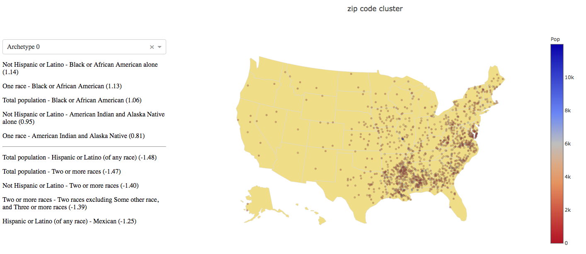

# Puppy Scientific Computing Talk April 2018
## Demographic Clustering ZCTA5

(Presentation slides in docs folder.)

It can be very interesting to perform regional clustering of the US based
on census data.  This is done, for example, at
[Patchwork Nation](http://www.patchworknation.org/)
and
[ESRI](https://www.esri.com/data/esri_data), to name a few. There, groups are
clustered based on various attributes, across the US.
So let's have a look at some clustering!

## Analysis and App

The notebook contains the one-off analysis, which saves the model details.
The model details are contained in the model folder, so the app
can be run immediately. Below is example output of the segmentation analysis:



## Run locally

Clone repo and then run the following from the project root:

```
$ docker build -f Dockerfile -t puppy_clustering .
$ docker run -v /full/path/to/project/root/:/root/app -p 0.0.0.0:8080:8080 -it puppy_clustering bash
```
And within the container:
```
# cd app
# python app.py
```

Then direct your browser to http://localhost:8080

## Notes

* Analysis requires R with packages: usdm, archetypes
* Docker

## Some package requirements
* Plotly
* Dash
* rpy2 
